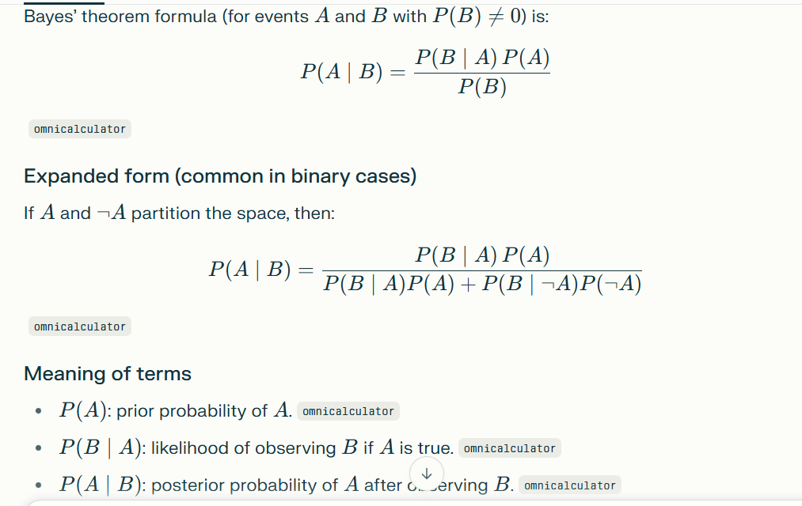

Project 6. Naive Bayes classifier for spam detection
Description:
Naive Bayes is a probabilistic classifier based on Bayes’ Theorem with an assumption of feature independence. It's especially effective for spam detection, thanks to its ability to handle high-dimensional text data. In this project, we’ll build a spam filter using a bag-of-words model and train a Naive Bayes classifier with scikit-learn.

Bayes therom is conditional probability :::  the formula is 

